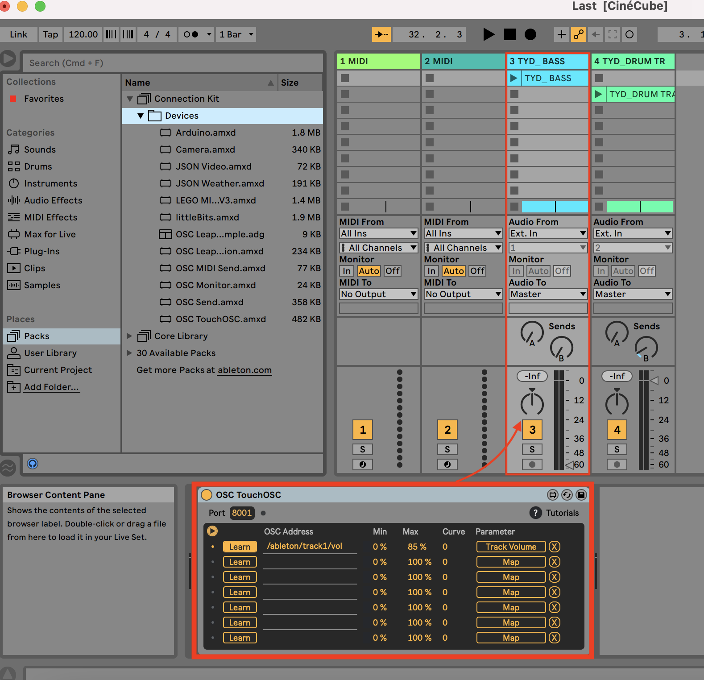

# CineCube
Connecting cinema audiences through playful interaction.

Project by Bureau Più: Nicoletta Mannella, Odin Shadmi, Robin Tepe & Simo Paraschi. Code by: Simo Paraschi

CineCube is a set of cubes placed inside the cinema hall that explore the topic of connectedness in the urban space of the cinema hall, by having the cinema audience collaboratively create music. Each cube is equipped with a sesnor that triggers a specific ‘channel’ of a song, i.e. an instrument. When moved at unison, all channels of a song will be played, creating thus collaboratively a final piece.

Read case study here: https://www.simoparaschi.io/case-study/design-for-interaction-in-urban-places

# Tools required:

- 3-axis accelerometer | I used the [Grove 3-Axis Digital Accelerometer](https://wiki.seeedstudio.com/Grove-3-Axis_Digital_Accelerometer-1.5g/)
- ESP 8266 | I used [Adafruit's Feather HUZZAH ESP8266](https://learn.adafruit.com/adafruit-feather-huzzah-esp8266/overview)
- A Digital Audio Workstation tht reads OSC messages | I used [Ableton Live](https://www.ableton.com/en/live/what-is-live/)
- Arduino IDE to flash ESP8266
- Wiring
- Laptop/PC

# How it works
Each cube contains an accelerometer detects when it;s being moved. The signals are sent via Wi-fi by the ESP8266 using the Open Sound Control (OSC) protocol. Ableton Live receives the OSC and then triggers the volume to go up when the cube is being moved, down when it's not.

# Connections
**ESP8266**   --     **Accelerometer**

SDA         --       SDA

SCL         --       SCL

3V          --       VCC

GND         --       GND

# Arduino IDE
To make sure the ESP8266 works with the arduino IDE, follow these instrcutions: (https://learn.adafruit.com/adafruit-feather-huzzah-esp8266/using-arduino-ide)
For the 3-axis acceleromenter, follow these instructions: (https://www.arduino.cc/reference/en/libraries/accelerometer_mma7660/)

# Ableton Live
Ableton Live can read incoming OSC messages using the OSC connection kit: (https://www.ableton.com/en/packs/connection-kit/)
You can then map the OSC signal to different effects or volume. I connected the signals sent by each accelerometer to the volume of aspecific channel  (e.g. an instrument in a song).

